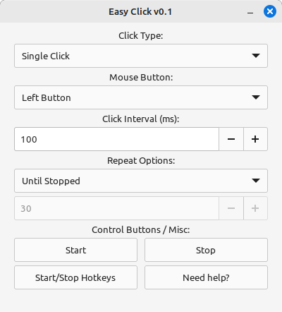

# EasyClick Autoclicker - v0.1


A simple and efficient autoclicker built using GTK4 and C. This project provides a user-friendly graphical interface for automating repetitive mouse clicks, which can be useful for various tasks such as software testing, game automation, and productivity enhancements. The application allows users to customize the interval between clicks, specify the number of clicks to be performed, and choose which mouse button to use. Though this version focuses on Linux, the code structure includes platform-specific sections for potential future expansions to Windows and macOS.

## Table of Contents
- [Features](#features)
- [Screenshot](#screenshot)
- [Installation](#installation)
  - [Prerequisites](#prerequisites)
  - [Build and Run](#build-and-run)
- [Development](#development)
  - [Code Structure](#code-structure)
  - [Dependencies](#dependencies)
  - [Contributing](#contributing)
- [Troubleshooting](#troubleshooting)
- [License](#license)
- [Acknowledgements](#acknowledgements)
- [Contact](#contact)

## Features
- **Start and Stop Buttons**: Simple buttons to control the autoclicker.
- **Customizable Click Interval**: Set the interval between clicks in milliseconds.
- **Click Counter**: Specify the number of clicks to perform.
- **Choice of Mouse Buttons**: Choose between left, right, and middle mouse buttons.
- **Cross-Platform Ready**: Though currently focused on Linux, the code includes platform-specific sections for Windows and macOS for future expansion.

## Screenshot


## Installation

### Prerequisites
Ensure you have the necessary dependencies installed:
```bash
sudo apt-get install libgtk-4-dev libxtst-dev
```

### Build and Run
1. Clone the repository:
```bash
git clone https://github.com/on3ye/easy-click.git
cd easy-click
```
2. Set up and build with Meson:
```bash
meson setup builddir
meson compile -C builddir
```
3. Run Application:
```bash
./builddir/src/final
```

## Development

### Code Structure
- src/main.c: Entry point of the application.
- src/activate.c: Main activation callback logic.
- src/gui.c: Contains GUI utilities and render function.
- src/signals.c: All signals functions callbacks.
- src/autoclicker.c: Contains the main logic for performing clicks.
- include/activate.h: Header file for `activate.c`.
- include/gui.h: Header file for `gui.c`.
- include/signals.h: Header file for `signals.c`.
- include/autoclicker.h: Header file for `autoclicker.c`.
- meson.build: Build configuration file for Meson.

### Dependencies
- __GTK4:__ The graphical toolkit used for building the GUI.
- __X11 and XTest:__ Required for simulating mouse clicks on Linux.

### Contributing
1. **Fork the repository:**
```bash
git fork https://github.com/on3ye/easy-click.git
```
2. **Create a new branch:**
```bash
git checkout -b feature-branch
```
3. **Make your changes:**
- Ensure your code is clean and follows the project's coding style.
- Write clear and concise commit messages.
- Test your changes thoroughly.
4. **Commit and push your changes:**
```bash
git commit -m 'Add new feature'
git push origin feature-branch
```
**5. Submit a pull request:** Go to the repository on GitHub and create a pull request.

## Troubleshooting

### Common Issues
- **Missing Dependencies:** Ensure all necessary dependencies are installed.
- **Build Errors:** Check the output of `meson compile` for specific error messages and resolve any issues.

### Contact for Support
If you encounter any issues, feel free to open an issue on GitHub or contact the maintainer.

## License
This project is licensed under the GNU-GPLv3 License. See the  file for details.

## Acknowledgements
- **GTK Team:** For the fantastic GTK toolkit.
- **Contributors:** To all the developers who have contributed to this project.
- **Users:** For their feedback and support.

## Contact
For any inquiries, please contact ``on3ye@proton.me``.

<hr>
<p align="center">
    <a href="https://github.com/yourusername/autoclicker">
        
    </a>
    <a href="https://github.com/yourusername/autoclicker/fork">
        
    </a>
</p>


